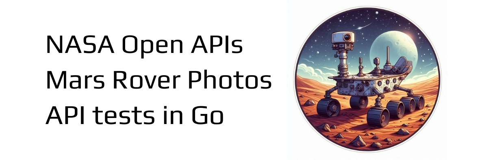
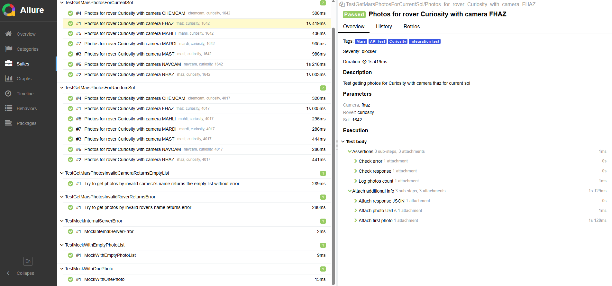
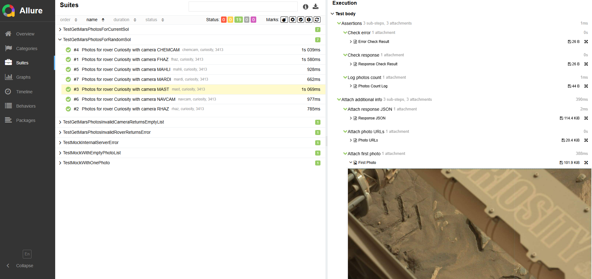

# mars-go-tests




A small educational project with API tests in Go for Mars Rover Photos by NASA Open APIs. 

## 🛰️ Project Description

This project demonstrates how to build and test a simple HTTP client in Go. 
It interacts with the [NASA Mars Rover Photos API](https://api.nasa.gov/) to fetch images taken by the rover *Curiosity*.

It includes:

- Real API integration
- Struct-based JSON decoding
- Table-driven integration tests
- Mock-tests
- Positive and negative tests
- Logging with slog
- Allure reports
- GitHub Actions workflow for CI (automated testing)
- Linter golangci-lint
- Docker support

## 📁 Project Structure
```
mars-go-tests/
├── .github/             # GitHub Actions
│   ├── workflows/       # CI/CD workflows
├── internal/
│   ├── api/             # API client logic
│   ├── config/          # Configuration loading
│   ├── constants/       # Base URL
│   ├── log/             # Logger
│   ├── models/          # Structs matching NASA's JSON format
├── test/                # Integration tests using real API, mock-tests, test data, test utils
├── go.mod / go.sum
├── .golangci.yml        # Linter configuration
├── Dockerfile           # Dockerfile for building and running the app
└── README.md
```

## 🚀 Getting Started

### 1. Clone the repository

```bash
git clone https://github.com/your-username/mars-go-tests.git
cd mars-go-tests
```

### 2. Get your NASA API key
Register at https://api.nasa.gov

You'll get a free API key by email

### 3. Add your config
Create a file at internal/config/config.json with your API key:

```
{
  "api_key": "your_actual_nasa_api_key_here"
}
```
Important: This file is ignored by Git. Do not commit your API key.

### 4. Run the tests
```bash
cd test
go test ./... 
```
You'll see real-time responses from NASA's Open API being tested.

## Allure Report is generated during test execution:



The report includes detailed information about the tests, with various attachments such as:

- Response JSON
- URLs of the mars rover's photos
- The first photo from the list

If running locally, to check the Allure Report, enter on the command line:
```bash
cd test
allure serve allure-results # This command will generate the report only when run from the 'test' directory
```

## To run the project in a Docker container, follow these steps:

### 1. Build the Docker image:
```bash
docker build -t mars-go-tests .
```
### 2. Run the container:
```bash
docker run -it --rm mars-go-tests
```
This will run the tests and build the application inside the container.

## GitHub Actions
The project uses GitHub Actions for continuous integration. The workflow file is located in .github/workflows/.
It includes the following steps:
- Set up Go environment
- Cache Go modules for faster builds
- Install Allure dependencies and generate test reports
- Run tests and lint checks

The workflow triggers automatically on push to the main branch.
You can view the build history and results on the [GitHub Actions page](https://github.com/slazarska/mars-go-tests/actions).
Additionally, you can download the generated Allure report as an artifact from the build results.

### Dependencies
- [Testify](https://github.com/stretchr/testify) for assertions
- [Allure-go](https://github.com/ozontech/allure-go) for test reporting 
- [golangci-lint](https://github.com/golangci/golangci-lint) for linting
- Standard Go modules (`go.mod`, `go.sum`)

### License
MIT — feel free to use for educational purposes.

### Author
Maintained by [@slazarska](https://github.com/slazarska)